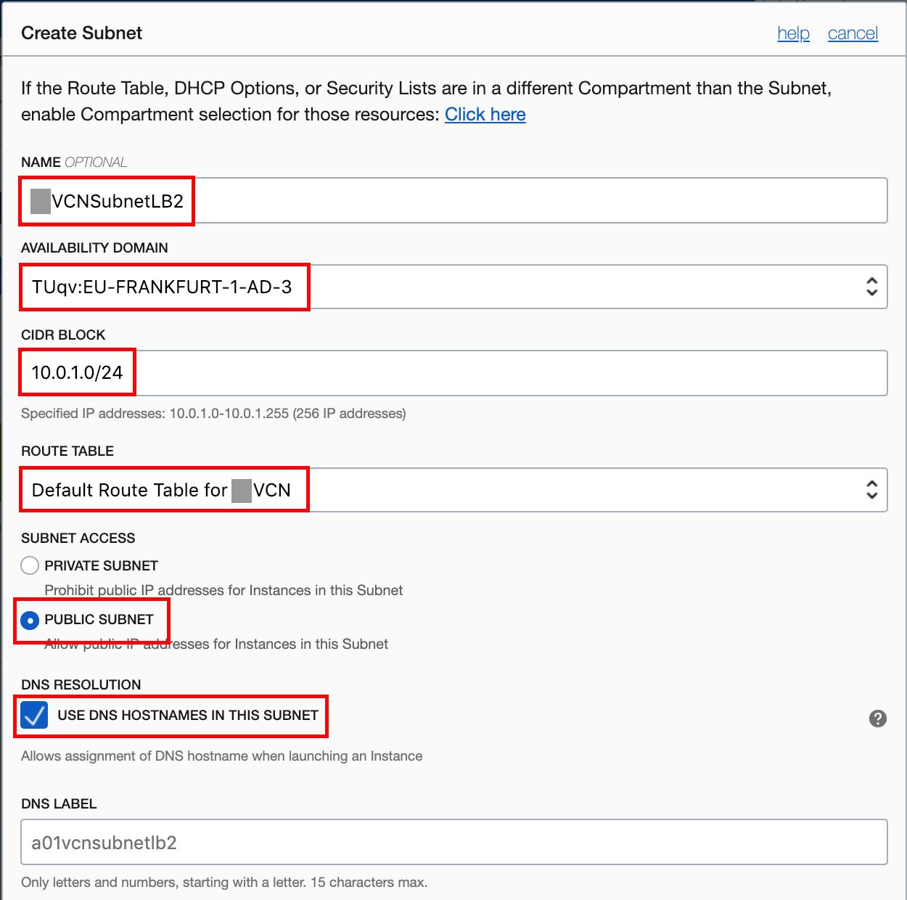
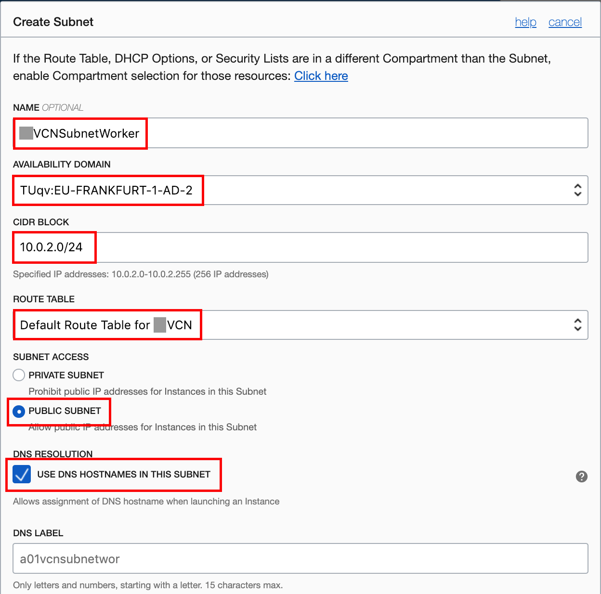
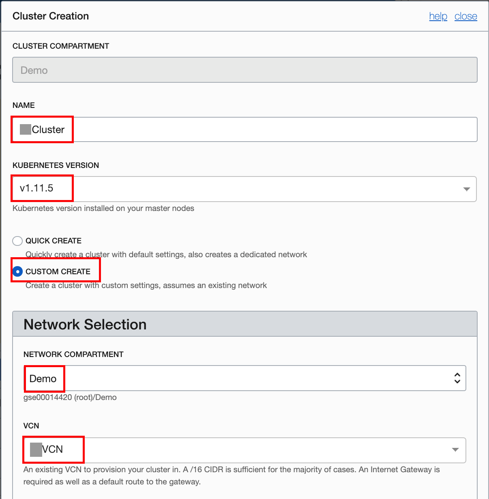
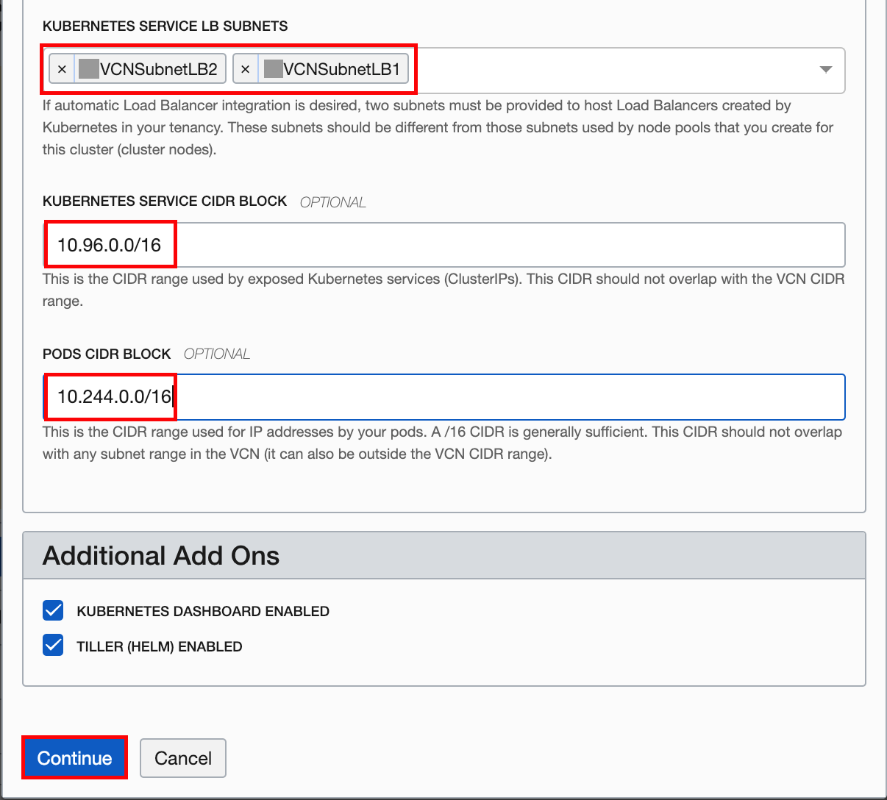
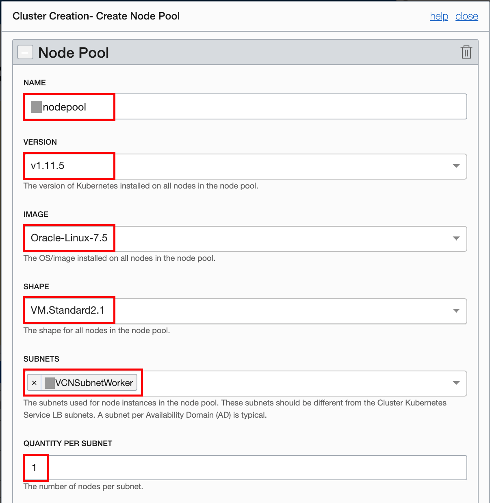
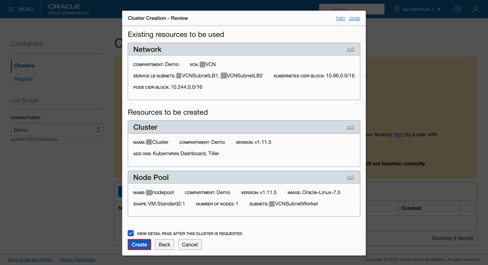

# Technical Fast Start to create Oracle Container Engine for Kubernetes (OKE) on Oracle Cloud Infrastructure (OCI) #

Oracle Cloud Infrastructure Container Engine for Kubernetes is a fully-managed, scalable, and highly available service that you can use to deploy your containerized applications to the cloud. Use Container Engine for Kubernetes (sometimes abbreviated to just OKE) when your development team wants to reliably build, deploy, and manage cloud-native applications. You specify the compute resources that your applications require, and Container Engine for Kubernetes provisions them on Oracle Cloud Infrastructure in an existing OCI tenancy.

### Prerequisites ###

[Oracle Cloud Infrastructure](https://cloud.oracle.com/en_US/cloud-infrastructure) enabled account.

To create Container Engine for Kubernetes (OKE) the following steps needs to be completed:

- Create network resources (VCN, Subnets, Security lists, etc.)
- Create Cluster.
- Create NodePool.

More information:

- [Oracle Container Engine documentation](https://docs.us-phoenix-1.oraclecloud.com/Content/ContEng/Concepts/contengoverview.htm)
- [About Kubernetes Clusters and Nodes](https://docs.us-phoenix-1.oraclecloud.com/Content/ContEng/Concepts/contengclustersnodes.htm)

#### Open the OCI console ####

Sign in to [OCI console](https://console.us-ashburn-1.oraclecloud.com) of the *gse00014420* tenant.

Use the *oke.user* and the password distributed by the instructor.

Also make sure you selected the correct region which is assigned by the instructor. For example: *eu-frankfurt-1*

#### Network Resources ####

In order to deploy an OKE cluster the compartment must contain the necessary network resources already configured: VCN, subnets, internet gateway, route table, security lists.

##### Virtual Cloud Network #####

The Virtual Cloud Network (VCN) is a private network that you set up in the Oracle data centers, with firewall rules and specific types of communication gateways that you can choose to use.

To create a highly available cluster spanning three availability domains, the VCN must include three subnets in different availability domains for node pools, and two further subnets for load balancers.

In this use case you are going to create a single node cluster which requires only one subnet.

Open the navigation menu. Under **Networking**, click **Virtual Cloud Networks**.

Before create any resource choose the instructor assigned compartment on the left bottom area of the page.

The page updates to display only the resources in that compartment. Click **Create Virtual Cloud Network**.

Enter the following:

- **Create in Compartment:** Select the assigned compartment, but after the previous selection it should be the default.
- **Name:** Using your ID as prefix name it: **ID**VCN. For example if your ID is *01* then the name is: *01VCN*
- **Create Virtual Cloud Network Only:** Make sure this radio button is selected.
- **CIDR Block:** A single, contiguous CIDR block for the cloud network. `10.0.0.0/16`. You cannot change this value later.
- **DNS Resolution:** Select the Use DNS Hostnames in this VCN checkbox.
- **DNS Label:** You can specify a DNS label for the VCN, but the Console will generate one for you based on the VCN name. The dialog box automatically displays the corresponding DNS Domain Name for the VCN (<VCN DNS label>.oraclevcn.com).
- **Tags:** Do not apply tag.

Click Create Virtual Cloud Network.

##### Security lists #####

A security list provides a virtual firewall for an instance, with ingress and egress rules that specify the types of traffic allowed in and out. Each security list is enforced at the instance level. However, you configure your security lists at the subnet level, which means that all instances in a given subnet are subject to the same set of rules. The security lists apply to a given instance whether it's talking with another instance in the VCN or a host outside the VCN.

On the **Networking** page select **Security Lists**. OKE requires at least two lists: one for worker nodes and one for the load balancer.

First define the security list for worker node. Click **Create Security List** to create new security list.

Enter the following:

- **Create in Compartment:** Select the assigned compartment.
- **Security List Name:** A friendly name for the security list e.g. *worker node seclist*
- **Ingress rules:**

| Type      | Source        | Protocol                    | Type/Source Port       | Destination Port           |Notes
|-----------|---------------|-----------------------------|------------------------|----------------------------|----------------------------------------------|
| Stateless | 10.0.2.0/24  | IP Protocol:  All Protocols |                        |                            |For intra-VCN traffic                         |
| Stateful  | 0.0.0.0/0     | IP Protocol: ICMP           | Type and Code: 3,4     |                            |                                              |
| Stateful  | 0.0.0.0/0  | IP Protocol: TCP            | Source Port Range: All | Destination Port Range: 22 |SSH Remote Login Protocol|
| Stateful  | 0.0.0.0/0  | IP Protocol: TCP            | Source Port Range: All | Destination Port Range: 30000-32767 |To access application e.g. Traefik, WebLogic in case if you [deploy WebLogic Domain](setup.weblogic.kubernetes.md).|
| Stateful  | 130.35.0.0/16 | IP Protocol: TCP            | Source Port Range: All | Destination Port Range: 22 |For the OCI Clusters service to access workers|
| Stateful  | 138.1.0.0/17  | IP Protocol: TCP            | Source Port Range: All | Destination Port Range: 22 |For the OCI Clusters service to access workers|
| Stateful  | 192.29.0.0/16 | IP Protocol: TCP            | Source Port Range: All | Destination Port Range: 22 |SSH Remote Login Protocol|
| Stateful  | 147.154.0.0/16  | IP Protocol: TCP            | Source Port Range: All | Destination Port Range: 22 |SSH Remote Login Protocol|

- **Egress rules:**

| Type      | Source       | Protocol                   |Notes
|-----------|--------------|----------------------------|-----------------------------------|
| Stateless | 10.0.2.0/24 | IP Protocol: All Protocols |For intra-VCN traffic              |
| Stateful  | 0.0.0.0/0    | IP Protocol: All Protocols |For outbound access to the internet|

Click **Create**.

Create a another security list for loadbalancer. Click again **Create Security List**.

Enter the following:

- **Create in Compartment:** Select the assigned compartment compartment.
- **Security List Name:** A friendly name for the security list e.g. *loadbalancer seclist*
- **Ingress rules:**

| Type      | Source        | Protocol                    | Type/Source Port       | Destination Port           |Notes
|-----------|---------------|-----------------------------|------------------------|----------------------------|-----------------------------------------------------|
| Stateless | 0.0.0.0/0     | IP Protocol: TCP            | Source Port Range: All | Destination Port Range: All|For incoming public traffic to service load balancers|

- **Egress rules:**

| Type      | Source        | Protocol                    | Type/Source Port       | Destination Port           |Notes
|-----------|---------------|-----------------------------|------------------------|----------------------------|---------------------------------------------------------------------|
| Stateless | 0.0.0.0/0     | IP Protocol: TCP            | Source Port Range: All | Destination Port Range: All|For responses from your application through the service load balancers|

Click **Create**.

##### Internet Gateway #####

To give the VCN access to the internet it requires an Internet Gateway as well as a default route to the gateway. You can think of an internet gateway as a router connecting the edge of the cloud network with the internet. Traffic that originates in your VCN and is destined for a public IP address outside the VCN goes through the internet gateway.

For traffic to flow between a subnet and an internet gateway, you must create a route rule accordingly in the subnet's route table (for example, 0.0.0.0/0 > internet gateway).

On the **Virtual Cloud Network** page click **Internet Gateways**. To create a new one click **Create Internet Gateway**.

Enter the following:

- **Create in Compartment:** The assigned compartment where you want to create the internet gateway.
- **Name:** A friendly name for the internet gateway. For example *ig-cluster-1*
- **Tags:** Don't apply tags.

Click **Create**.

##### Route Tables #####

Cloud network uses virtual route tables to send traffic out of the VCN (for example, to the Internet or to your on-premises network). These virtual route tables have rules that look and act like traditional network route rules you might already be familiar with. Each rule specifies a destination CIDR block and the target (the next hop) for any traffic that matches that CIDR.

While viewing the VCN's details, click **Route Tables**. Click the default route table to modify.

Click **Edit Route Rules**.

Click **+Another Route Rule**.

Enter the following:

- **Destination CIDR block:** `0.0.0.0/0` (which means that all non-intra-VCN traffic that is not already covered by other rules in the route table will go to the target specified in this rule)
- **Target Type:** *Internet Gateway*
- **Compartment:** The compartment where the internet gateway is located.
- **Target:** The internet gateway you just created.

Click **Save**.

##### Subnets #####

A cloud network is a software-defined network that you set up in Oracle data centers. A subnet is a subdivision of a cloud network. You can privately connect a VCN to another VCN in the same region so that the traffic does not traverse the internet. The CIDRs for the two VCNs must not overlap.

Each subnet in a VCN exists in a single availability domain and consists of a contiguous range of IP addresses that do not overlap with other subnets in the cloud network. Example: 172.16.1.0/24. The first two IP addresses and the last in the subnet's CIDR are reserved by the Networking service. You can't change the size of the subnet after creation, so it's important to think about the size of subnets you need before creating them. Also, the subnet acts as a unit of configuration: all instances in a given subnet use the same route table, security lists, and DHCP options.

In this scenario 3 subnets are required.

- 1 subnet will be used to deploy 1 worker node.
- 2 subnets will be used for hosting load balancers. Each of those should be in a different(!) availability domain.

First create for the loadbalancers.

While viewing the VCN's details, click **Create Subnet**.

In the Create Subnet dialog box, you specify the resources to associate with the subnet (for example, a route table, and so on). By default, the subnet will be created in the current compartment, and you'll choose the resources from the same compartment.

Enter the following:

- **Name:** Using your ID name it using the following pattern: **ID**VCNSubnetLB1. For example (if ID is 01): *01VCNSubnetLB1*
- **Availability Domain:** The availability domain for the subnet. Select the availability domain which is assigned to you. For example *TUqv:EU-FRANKFURT-1-AD-2*.
- **CIDR Block:** A single, contiguous CIDR block for the subnet: `10.0.0.0/24`. You cannot change this value later.
- **Route Table:** The route table to associate with the subnet. Select the default route table what you have modified in the previous steps.
- **Private or public subnet:** Select *PUBLIC SUBNET*. This means the  VNICs in the subnet can have public IP addresses.
- **Use DNS Hostnames in this Subnet:** Leave default which has to be selected.
- **DNS Label:** The Console will generate one based on the VCN DNS label.
- **DHCP Options:** Select the available default DHCP options for your VCN.
- **Security Lists:** Select the previously created *loadbalancer seclist* security list.
- **Tags:** Do not apply tags.

Click **Create**.

Now repeate the subnet creation but use different name, CIDR, DNS label and availability domain. Click **Create Subnet**.

Enter the following:

- **Name:** Using your ID name it using the following pattern: **ID**VCNSubnetLB2. For example (if ID is 01): *01VCNSubnetLB2*
- **Availability Domain:** The availability domain for the subnet. Now select an availability domain which is NOT assigned to you. For example if the availability domain assigned to you is *TUqv:EU-FRANKFURT-1-AD-2* then select *TUqv:EU-FRANKFURT-1-AD-3*.
- **CIDR Block:** A single, contiguous CIDR block for the subnet: `10.0.1.0/24`. You cannot change this value later.
- **Route Table:** The route table to associate with the subnet. Select the default route table what you have modified in the previous steps.
- **Private or public subnet:** Select *PUBLIC SUBNET*. This means the  VNICs in the subnet can have public IP addresses.
- **Use DNS Hostnames in this Subnet:** Leave default which has to be selected.
- **DNS Label:** The Console will generate one based on the VCN DNS label.
- **DHCP Options:** Select the available default DHCP options for your VCN.
- **Security Lists:** Select the same *loadbalancer seclist* security list what you created in the previous steps.
- **Tags:** Optionally, you can apply tags.

Click **Create**.

Loadbalancers subnets are ready. Now create 1 subnet for the single worker node.

Click **Create Subnet**.

Enter the following:

- **Name:** Using your ID name it using the following pattern: **ID**VCNSubnetWorker. For example (if ID is 01): *01VCNSubnetWorker*
- **Availability Domain:** The availability domain for the subnet. Important to select the availability domain which is assigned to you. For example *TUqv:EU-FRANKFURT-1-AD-2*.
- **CIDR Block:** A single, contiguous CIDR block for the subnet: `10.0.2.0/24`. You cannot change this value later.
- **Route Table:** The route table to associate with the subnet. Select the default route table what you have modified in the previous steps.
- **Private or public subnet:** Select *PUBLIC SUBNET*. This means the  VNICs in the subnet can have public IP addresses.
- **Use DNS Hostnames in this Subnet:** Leave default which has to be selected.
- **DNS Label:** The Console will generate one based on the VCN DNS label.
- **DHCP Options:** Select the available default DHCP options for your VCN.
- **Security Lists:** Select the same *worker node seclist* security list what you created in the previous steps.
- **Tags:** Do not apply tags.

Click **Create**.

##### Create Cluster #####

Now you have all the necessary resources to create OKE cluster. First specify details for the cluster (for example, the Kubernetes version to install on master nodes). Having defined the cluster, you typically specify details for different node pools in the cluster (for example, the node shape, or resource profile, that determines the number of CPUs and amount of memory assigned to each worker node). Note that although you will usually define node pools immediately when defining a cluster, you don't have to. You can create a cluster with no node pools, and add node pools later.

In the **Console**, open the navigation menu. Click **Containers**. Choose a Compartment you have permission to work in, and then click Clusters.

First make sure your assigned compartment is still selected then click **Create Cluster**.

Specify configuration details for the new cluster:

- **Name:** Using your ID write the following name: **ID**Cluster. For example: *01Cluster*
- **Version:** The version of Kubernetes to run on the master node of the cluster. Select the currently available latest *v1.11.5*.
- **Custom Create:** Select custom because you already created the necessary network resources.
- **VCN:** The name of the VCN what you created earlier. For example: *01VCN*
- **Kubernetes Service LB Subnets:** The two subnets configured to host load balancers. For example: *01VCNSubnetLB1*, *01VCNSubnetLB2*
- **Kubernetes Service CIDR Block:** The available group of network addresses that can be exposed as Kubernetes services (ClusterIPs), expressed as a single, contiguous IPv4 CIDR block. Enter: `10.96.0.0/16`. (The CIDR block you specify must not overlap with the CIDR block for the VCN.)
- Pods CIDR Block: The available group of network addresses that can be allocated to pods running in the cluster, expressed as a single, contiguous IPv4 CIDR block. Enter: `10.244.0.0/16`. (The CIDR block you specify must not overlap with the CIDR blocks for subnets in the VCN, and can be outside the VCN CIDR block.)
- **Kubernetes Dashboard Enabled:** Leave the default selected to use the Kubernetes Dashboard to deploy and troubleshoot containerized applications, and to manage Kubernetes resources.
- **Tiller (Helm) Enabled:** Leave default selected. With Tiller running in the cluster, you can use Helm to manage Kubernetes resources.

Click **Continue**.

Specify configuration details for the first node pool in the cluster:

- **Name:** Using your ID name the new node pool. For example: *IDnodepool*
- **Version:** The version of Kubernetes to run on each worker node in the node pool. By default, the version of Kubernetes specified for the master node is selected. The Kubernetes version on worker nodes must be either the same version as that on the master node, or an earlier version that is still compatible. Select: *v1.11.5*.
- **Image:** The image to use on each node in the node pool. An image is a template of a virtual hard drive that determines the operating system and other software for the node. Select: *Oracle-Linux-7.5*
- **Shape:** Select the shape assigned by the instructor. For example: *VM.Standard2.1*
- **Subnet:** Select the available subnet configured to host worker node. For example: *01VCNSubnetWorker* (**ID**VCNSubnetWorker)
- **Quantity per Subnet:** The number of worker nodes to create for the node pool in each subnet. Enter *1*.
- **Public SSH Key:** The public key portion of the key pair you need to use for SSH access to each node in the node pool. The public key is installed on all worker nodes in the cluster. Use the following public ssh key:

		ssh-rsa AAAAB3NzaC1yc2EAAAADAQABAAABAQDT53WIGqHj+7FXJiRRCmrxCmE+qJvjrJSASinhs8/aEEm4XhsSDy67gXSovrkjSq//kisET6wmOymKCEF2zQGxyZY/rBCLOc/of1sm2Yoo5S1bNvKJQbgjN9LPz0EXOs3qGThUKQKsthQOeWgZGoUiaLplskGBVmXQ+3WT8vtNZxJ9fbCp89fRGyUzF9fSCclpp7eAqirSOhgAoK8D6S1138kxxTwpc32A4FRqrTaqaWlioCjzxRFTnygSnOEgPv2Go7CPSsFghm2XYVyAtsftIEFyphVSJ66CbfjRw+L9b6v8/fRzA0UBZwtLxECO6WSXbGNKhTXJ3T0CKXXRgzCH

Click **Review**.

Check the configuration and click **Create**.

Container Engine for Kubernetes starts creating the cluster. When the cluster has been created, it has a status of *Active*.

Also when the nodes have been created and configured, they have *Active* status too. Note the Public IP address(es) assigned to the node(s).

##### Configure kubectl #####

To get kubernetes configuration first you need to configure OCI CLI. To make it easier for this lab the necessary configuration and keys are done and just needs to be download to the proper location in the provided environment (VirtualBox image). Depending on your region execute the following command in a terminal:

|Region|Command|
|------|-------|
|eu-frankfurt-1|bash -c "$(curl -L "http://bit.ly/configfrankfurt")"|
|us-ashburn-1|bash -c "$(curl -L "http://bit.ly/configashburn")"|
|us-phoenix-1|bash -c "$(curl -L "http://bit.ly/configphoenix")"|
|uk-london-1|bash -c "$(curl -L "http://bit.ly/configlondon")"|

For example:

	$ bash -c "$(curl -L "http://bit.ly/configfrankfurt")"
	% Total    % Received % Xferd  Average Speed   Time    Time     Time  Current
                                 Dload  Upload   Total   Spent    Left  Speed
	100   171  100   171    0     0    219      0 --:--:-- --:--:-- --:--:--   218
	  0     0    0   388    0     0    173      0 --:--:--  0:00:02 --:--:--   838
	100   671  100   671    0     0    191      0  0:00:03  0:00:03 --:--:--   782
	Setup OCI CLI for Frankfurt
	  % Total    % Received % Xferd  Average Speed   Time    Time     Time  Current
	                                 Dload  Upload   Total   Spent    Left  Speed
	100   388    0   388    0     0    264      0 --:--:--  0:00:01 --:--:--   264
	100   304  100   304    0     0    108      0  0:00:02  0:00:02 --:--:--   422
	  % Total    % Received % Xferd  Average Speed   Time    Time     Time  Current
	                                 Dload  Upload   Total   Spent    Left  Speed
	100   388    0   388    0     0    253      0 --:--:--  0:00:01 --:--:--   253
	100  1674  100  1674    0     0    606      0  0:00:02  0:00:02 --:--:--  4997
	  % Total    % Received % Xferd  Average Speed   Time    Time     Time  Current
	                                 Dload  Upload   Total   Spent    Left  Speed
	100   388    0   388    0     0    234      0 --:--:--  0:00:01 --:--:--   234
	100  1679  100  1679    0     0    598      0  0:00:02  0:00:02 --:--:--  6359
	Configuration for Frankfurt is done.

Similar output means your necessary configuration and access keys are downloaded and the CLI setup now is done.

To complete the `kubectl` configuration click **Access Kubeconfig**.

A dialog pops up which contains the customized OCI command what you need to execute to create Kubernetes configuration file.

Copy and execute the commands on your desktop where OCI CLI was configured.

	$ mkdir -p $HOME/.kube
	$ oci ce cluster create-kubeconfig --cluster-id ocid1.cluster.oc1.eu-frankfurt-1.aaaaaaaaaezwenlfgm4gkmzxha2tamtcgjqwmoldmu3tcnlfgc2tcyzzmrqw --file $HOME/.kube/config --region eu-frankfurt-1

Don't forget to set the KUBECONFIG  variable to the newly created `kubectl` config file.

	$export KUBECONFIG=$HOME/.kube/config

Now check the `kubectl` for example using the `get node` command:

	$ kubectl get node
	NAME            STATUS    ROLES     AGE       VERSION
	130.61.58.206   Ready     node      16m       v1.11.5

If you see the node's information the configuration was successful. Compare the name of the node to the Public IP address of the node available on the web console.

Congratulation, now you have OCI - OKE environment ready to deploy your application.
